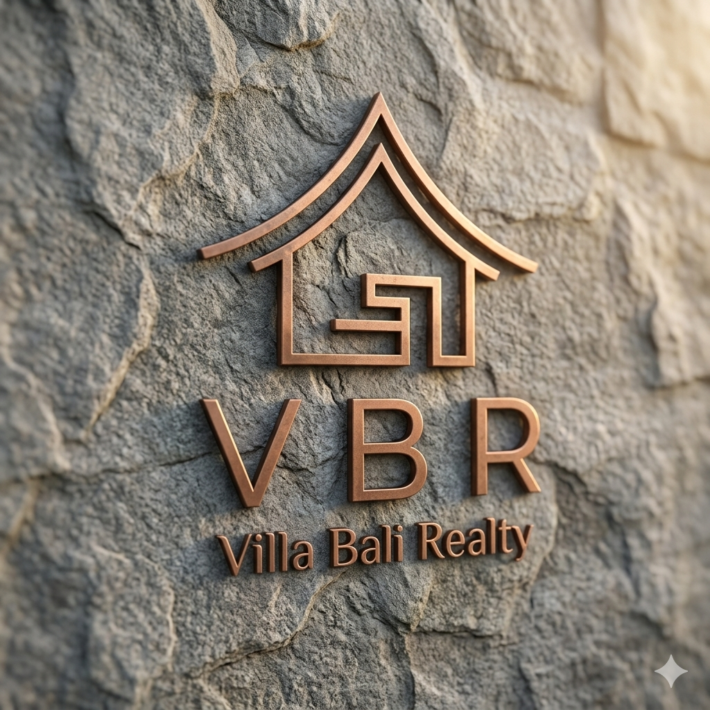

# CUSTOMIZATION GUIDE — Villa Bali Realty

> Panduan lengkap untuk mengkustomisasi website **Villa Bali Realty** tanpa merusak struktur sistem.

---

## Table of Contents

1. [Project Overview](#1-project-overview)
2. [Technology Stack](#2-technology-stack)
3. [Project Structure](#3-project-structure)
4. [Running the Project Locally](#4-running-the-project-locally)
5. [Website Architecture](#5-website-architecture)
6. [Customization Guide](#6-customization-guide)
7. [Adding New Property](#7-adding-new-property)
8. [Editing Layout Safely](#8-editing-layout-safely)
9. [Common Mistakes](#9-common-mistakes)
10. [Customization Examples](#10-customization-examples)

---

## 1. Project Overview

**Villa Bali Realty** adalah website agen properti statis yang menampilkan listing villa dan properti mewah di Bali. Website ini berfungsi sepenuhnya di sisi klien (browser) tanpa memerlukan server backend atau database eksternal.

### Cara kerja website:
- Halaman utama (`index.html`) memuat daftar properti secara dinamis dari file `properties.json` menggunakan JavaScript.
- Setiap properti bisa diklik untuk membuka halaman detail (`property.html`), yang membaca data berdasarkan parameter `?id=` di URL.
- Semua gambar disimpan secara lokal di folder `images/` atau menggunakan URL eksternal (misalnya Unsplash).
- Tidak ada form submission yang aktif ke server — form kontak hanya menampilkan pesan sukses di browser.

---

## 2. Technology Stack

| Teknologi | Peran |
|-----------|-------|
| **HTML** | Struktur halaman dan konten statis |
| **CSS** | Styling, layout, animasi, dan tema visual |
| **JavaScript** | Memuat data JSON, merender kartu properti, navigasi mobile, animasi scroll |
| **JSON** | Database properti (`properties.json`) |
| **Google Fonts** | Font `Cormorant Garamond` (display) dan `Jost` (body) |

---

## 3. Project Structure

```
src/
│
├── index.html          # Halaman utama (one-page website)
├── property.html       # Halaman detail properti
│
├── script.js           # JS untuk index.html (load properti, navbar, form)
├── property-detail.js  # JS untuk property.html (gallery, render detail)
│
├── style.css           # Semua styling CSS untuk kedua halaman
├── properties.json     # Database properti dalam format JSON
│
└── images/
    ├── logo.jpg                    # Logo perusahaan
    ├── hero-background.jpg         # Gambar background hero section
    ├── foto-agen.jpg               # Foto agen
    ├── klien-hiroshi.jpg           # Foto testimoni klien
    ├── klien-james.jpg             # Foto testimoni klien
    ├── klien-sophie.jpg            # Foto testimoni klien
    │
    └── properties/
        ├── canggu-modernist-hideaway.jpg
        ├── clifftop-villa-uluwatu.jpg
        ├── jimbaran-ocean-view-villa.jpg
        ├── sanur-heritage-compound.jpg
        ├── seminyak-beachfront-estate.jpg
        └── tropical-rice-field-retreat.jpg
```

### Fungsi setiap file:

**`index.html`** — Halaman one-page utama yang berisi semua section: navbar, hero, daftar properti, about agent, why us, testimonials, CTA, contact, dan footer.

**`property.html`** — Halaman detail properti. Tidak berisi data apapun secara langsung — semua data diisi oleh `property-detail.js` berdasarkan ID dari URL.

**`script.js`** — Mengelola: navbar scroll behavior, mobile menu toggle, fetch dan render properti dari `properties.json`, animasi scroll reveal, dan validasi form kontak.

**`property-detail.js`** — Membaca `?id=` dari URL, fetch `properties.json`, menemukan properti yang sesuai, dan mengisi semua elemen di `property.html` termasuk gallery thumbnail.

**`style.css`** — Satu file CSS untuk kedua halaman. Menggunakan CSS Custom Properties (variabel) di `:root` untuk kontrol tema terpusat.

**`properties.json`** — Array JSON yang menjadi sumber data seluruh listing properti. Setiap objek mewakili satu properti dengan field: id, title, location, price, type, beds, baths, sqm, land_sqm, description, image, images[], dan tag.

---

## 4. Running the Project Locally

Website ini adalah **static website** — membutuhkan static server lokal untuk bisa berjalan karena JavaScript menggunakan `fetch()` untuk membaca `properties.json`.

> ⚠️ **Jangan buka `index.html` langsung di browser** (klik dua kali dari file explorer). Cara ini akan menyebabkan `properties.json` gagal dimuat karena browser memblokir `fetch()` pada protokol `file://`.

### Opsi 1: VS Code Live Server (Direkomendasikan)

1. Install ekstensi **Live Server** di VS Code
2. Buka folder `src/` di VS Code
3. Klik kanan pada `index.html` → **"Open with Live Server"**
4. Website akan terbuka di browser di `http://127.0.0.1:5500`

### Opsi 2: Node.js `serve`

```bash
# Install sekali saja
npm install -g serve

# Jalankan dari folder src/
cd src
serve .
```

Website tersedia di `http://localhost:3000`

### Opsi 3: Python HTTP Server

```bash
# Dari folder src/
cd src

# Python 3
python -m http.server 8000

# Python 2
python -m SimpleHTTPServer 8000
```

Website tersedia di `http://localhost:8000`

---

## 5. Website Architecture

### Alur data dari `properties.json` ke tampilan

```
properties.json
      │
      │  fetch() oleh script.js / property-detail.js
      ▼
  JavaScript membaca array JSON
      │
      ├─── index.html ──▶ buildPropertyCard() ──▶ renderProperties()
      │                   Merender kartu-kartu di #propertiesGrid
      │
      └─── property.html ──▶ getPropertyIdFromURL() ──▶ renderPropertyDetail()
                             Mengisi semua field detail via DOM
```

### `index.html` + `script.js`

1. Saat halaman dimuat, `script.js` memanggil `loadProperties()`.
2. Fungsi ini `fetch('./properties.json')`, lalu memanggil `renderProperties(data)`.
3. `renderProperties()` membersihkan skeleton placeholder di `#propertiesGrid`, lalu memanggil `buildPropertyCard()` untuk setiap properti.
4. `buildPropertyCard()` menghasilkan HTML string satu kartu dan menyisipkannya ke DOM.
5. Jika `fetch()` gagal (misalnya tidak pakai server), data fallback hardcoded di `FALLBACK_PROPERTIES` digunakan.

### `property.html` + `property-detail.js`

1. Saat kartu properti diklik di `index.html`, browser navigasi ke `property.html?id=3` (contoh).
2. `property-detail.js` membaca `?id=` dari URL dengan `getPropertyIdFromURL()`.
3. File `properties.json` di-fetch ulang.
4. Properti dengan `id` yang cocok dicari dengan `.find()`.
5. `renderPropertyDetail(property)` mengisi semua elemen HTML (`detailTitle`, `sidebarPrice`, gallery, dll.) dengan data properti.
6. Link WhatsApp di sidebar di-generate otomatis dengan nama dan harga properti.

---

## 6. Customization Guide

### 6.1 Logo Perusahaan

**File:** `index.html` dan `property.html` (footer)

Ganti file gambar logo:
```
images/logo.jpg  →  ganti dengan logo baru (disarankan format JPG/PNG, ukuran 80×80px atau persegi)
```

Pastikan nama file tetap `logo.jpg`, ATAU ubah path di HTML:

```html
<!-- index.html, baris ~22 -->
<div class="logo-mark"></div>
```

Ganti menjadi:
```html
<div class="logo-mark"></div>
```

> **Catatan:** Di footer `index.html` (baris ~535), logo juga digunakan jika ingin sedikit berbeda dengan logo bagian utama silahkan ubah pada: 
```html
<div class ="logo-mark"></div>
```

---

### 6.2 Nama Perusahaan

Nama perusahaan muncul di beberapa tempat di `index.html`. Cari dan ganti semua kemunculan `Villa Bali Realty`:

| Lokasi | Kode yang perlu diubah |
|--------|------------------------|
| Tab browser | `<title>Villa Bali Realty — Luxury Property in Bali</title>` |
| Meta description | `content="... Villa Bali Realty ..."` |
| Navbar logo | `<span class="logo-name">Villa Bali Realty</span>` |
| Navbar tagline | `<span class="logo-tagline">Luxury Property Specialists</span>` |
| Footer brand | `<span class="logo-name">Villa Bali Realty</span>` |
| Footer copyright | `© 2025 Villa Bali Realty. All rights reserved.` |
| Section "Why Choose Us" | `Why Choose<br>Villa Bali Realty` |

Lakukan juga di `property.html` untuk title tab.

---

### 6.3 Hero Section

**File:** `index.html` — section `#hero`

#### Gambar background hero:
```
images/hero-background.jpg  →  ganti dengan foto baru
```

Nama file harus tetap `hero-background.jpg`, ATAU ubah path di `script.js`:

```javascript
// script.js, baris ~75
heroImg.src = 'images/hero-background.jpg';
```

#### Teks headline hero:
```html
<!-- index.html, sekitar baris 75-80 -->
<h1 class="hero-title">
  Find Your<br>Dream Property<br><em>in Bali</em>
</h1>

<p class="hero-sub">
  Expert guidance through every step of your Bali real estate journey —
  from discovering the perfect villa to securing your investment with confidence.
</p>
```

#### Label eyebrow (teks kecil di atas headline):
```html
<div class="hero-eyebrow">
  <span>Bali's Premier Real Estate Agency</span>
</div>
```

#### Statistik hero (kanan):
```html
<div class="hero-stat">
  <span class="num">200+</span>
  <span class="label">Villas Sold</span>
</div>
```

---

### 6.4 Warna Brand

**File:** `style.css` — bagian `:root` (baris 11–46)

Semua warna diatur sebagai CSS Custom Properties. Ubah di sini dan seluruh website akan ikut berubah.

```css
:root {
  /* Warna utama background */
  --cream:       #F5F0E8;   /* Background halaman */
  --cream-dark:  #EDE6D6;   /* Background section gelap */

  /* Warna aksen utama (hijau tua) */
  --forest:      #2C4A3E;
  --forest-deep: #1A2E28;   /* Warna teks heading */
  --forest-light:#3D6357;

  /* Warna aksen kedua (emas) */
  --gold:        #B8924A;   /* Warna tombol, label section, highlight */
  --gold-light:  #D4AA6A;

  /* Warna teks dan netral */
  --charcoal:    #2A2A2A;   /* Warna teks body utama */
  --warm-gray:   #8A8278;   /* Teks sekunder */
  --white:       #FDFCFA;
}
```

**Contoh: Mengubah tema dari hijau ke biru navy:**
```css
:root {
  --forest:      #1E3A5F;
  --forest-deep: #0F2240;
  --forest-light:#2A5080;
  --gold:        #C4962A;
  --gold-light:  #DEB84A;
}
```

---

### 6.5 Tema Website (Font)

**File:** `style.css` — baris 8 dan 24–25

#### Mengganti font:
```css
/* Baris 8 — import font Google Fonts baru */
@import url('https://fonts.googleapis.com/css2?family=Playfair+Display:ital,wght@0,400;0,700;1,400&family=Inter:wght@300;400;500;600&display=swap');

/* Baris 24–25 — terapkan font ke variabel */
--ff-display: 'Playfair Display', Georgia, serif;  /* Font judul/heading */
--ff-body:    'Inter', sans-serif;                 /* Font teks biasa */
```

---

### 6.6 Nomor WhatsApp dan Link Pesan

Nomor WhatsApp muncul di **3 tempat**:

#### 1. Informasi kontak (index.html, section contact):
```html
<!-- index.html, sekitar baris 426 -->
<span>+62 812 3456 7890</span>
```
Ganti dengan nomor baru (ini hanya teks, tidak membuka WhatsApp).

#### 2. Footer — link ikon WhatsApp (index.html):
```html
<!-- index.html, sekitar baris 555 -->
<a href="https://wa.me/6281234567890" class="social-link" aria-label="WhatsApp" ...>
```

Format: `https://wa.me/` + nomor tanpa tanda `+`, spasi, atau tanda hubung.
Contoh nomor `+62 812 3456 7890` → `https://wa.me/6281234567890`

#### 3. Sidebar halaman detail properti (property-detail.js):
```javascript
// property-detail.js, baris ~168
sidebarWa.href = `https://wa.me/6281234567890?text=${waMessage}`;
```

Ganti `6281234567890` dengan nomor baru di ketiga tempat ini.

#### Mengubah pesan otomatis WhatsApp:
```javascript
// property-detail.js, baris ~165-167
const waMessage = encodeURIComponent(
  `Halo, saya tertarik dengan properti *${property.title}* di ${property.location} (${property.price}). Boleh saya mendapatkan detail lebih lanjut?`
);
```

---

### 6.7 Link Media Sosial

**File:** `index.html` — section footer, div `.social-links` (sekitar baris 545–561)

Ganti nilai `href="#"` dengan URL akun media sosial yang sebenarnya:

```html
<!-- Instagram -->
<a href="https://www.instagram.com/namaakun" class="social-link" aria-label="Instagram">

<!-- Facebook -->
<a href="https://www.facebook.com/namaakun" class="social-link" aria-label="Facebook">

<!-- LinkedIn -->
<a href="https://www.linkedin.com/company/namaakun" class="social-link" aria-label="LinkedIn">

<!-- WhatsApp (lihat section 6.6) -->
<a href="https://wa.me/6281234567890" class="social-link" aria-label="WhatsApp">

<!-- YouTube -->
<a href="https://www.youtube.com/@namaakun" class="social-link" aria-label="YouTube">
```

Untuk **menghapus** ikon media sosial yang tidak digunakan, hapus seluruh elemen `<a>` beserta isinya. Contoh hapus YouTube:

```html
<!-- Hapus/comment blok ini seluruhnya: -->
<a href="#" class="social-link" aria-label="YouTube">
  <svg ...>...</svg>
</a>
```

---

### 6.8 Foto Agent

**File:** `index.html` — section `#about` (sekitar baris 165-170)

Ganti foto agent:
1. Simpan foto agent di `images/foto-agen.jpg`
2. Ubah `src` menjadi:
```html

```

Ubah juga nama dan bio agent di bawahnya:
```html
<h2 class="section-title" id="about-heading">Nama<br>Agent</h2>
<p class="about-title-sub">Jabatan &amp; Posisi</p>
<p class="about-bio">Biografi agent...</p>
```

---

### 6.9 Informasi Kontak

**File:** `index.html` — section `#contact` (sekitar baris 415–445)

```html
<!-- Alamat -->
<span>Jl. Petitenget No. 18B, Seminyak,<br>Badung, Bali 80361, Indonesia</span>

<!-- Telepon/WhatsApp -->
<span>+62 812 3456 7890</span>

<!-- Email -->
<span><a href="mailto:info@villabalirealty.com">info@villadalirealty.com</a></span>

<!-- Jam buka -->
<span>Mon–Sat: 9:00 AM – 6:00 PM WITA</span>
```

---

### 6.10 Google Maps Embed

**File:** `index.html` — sekitar baris 451–457

```html
<iframe
  src="https://www.google.com/maps/embed?pb=!1m18!..."
  ...
></iframe>
```

#### Cara mendapatkan embed URL baru:
1. Buka [Google Maps](https://maps.google.com)
2. Cari lokasi kantor Anda
3. Klik **Share** → **Embed a map**
4. Salin kode `<iframe>` yang diberikan
5. Ganti `src="..."` di `index.html` dengan URL baru dari Google Maps

---

### 6.11 Testimoni Client

**File:** `index.html` — section `#testimonials` (sekitar baris 298–360)

Setiap testimoni memiliki struktur:
```html
<article class="testimonial-card reveal reveal-delay-1">
  <div class="testimonial-quote">"</div>
  <div class="testimonial-stars">★★★★★</div>
  <p class="testimonial-text">
    Isi testimoni di sini...
  </p>
  <div class="testimonial-author">
    <div class="author-avatar">
      
    </div>
    <div class="author-info">
      <div class="author-name">Nama Klien</div>
      <div class="author-origin">Kota, Negara — Keterangan transaksi</div>
    </div>
  </div>
</article>
```

#### Menggunakan foto klien lokal:
1. Simpan foto di `images/` (contoh: `images/klien-budi.jpg`)
2. Ubah `src` menjadi `src="images/klien-budi.jpg"`

#### Menambah testimoni:
Salin satu blok `<article class="testimonial-card ...">` dan tempel setelah testimoni terakhir. Ubah angka delay: `reveal-delay-1`, `reveal-delay-2`, `reveal-delay-3`, dst.

#### Menghapus testimoni:
Hapus seluruh blok `<article class="testimonial-card ...">...</article>`.

---

### 6.12 Property Listing

Data properti dikelola sepenuhnya dari `properties.json`. Lihat [Section 7](#7-adding-new-property) untuk panduan lengkap.

---

### 6.13 Gambar Property

Setiap properti di `properties.json` memiliki dua field gambar:

```json
"image": "images/properties/nama-file.jpg",
"images": [
  { "url": "images/properties/nama-file.jpg", "alt": "Deskripsi gambar" },
  { "url": "images/properties/nama-file-2.jpg", "alt": "Deskripsi gambar 2" }
]
```

- **`image`** — gambar utama yang tampil di kartu listing pada `index.html`
- **`images[]`** — array semua gambar untuk gallery di halaman detail `property.html`

Gambar bisa berupa:
- **Path lokal:** `"images/properties/nama-file.jpg"` (file harus ada di folder tersebut)
- **URL eksternal:** `"https://images.unsplash.com/photo-abc?w=800&q=80"`

---

### 6.14 Deskripsi Property

Edit langsung di `properties.json`:

```json
{
  "description": "Deskripsi singkat untuk kartu listing (1-2 kalimat).",
  ...
}
```

Deskripsi ini tampil di:
- Kartu properti di `index.html` (terpotong otomatis oleh CSS jika terlalu panjang)
- Halaman detail `property.html`

---

## 7. Adding New Property

### Langkah-langkah menambahkan properti baru:

#### Step 1 — Siapkan gambar

Simpan gambar properti di folder `images/properties/`. Gunakan nama file tanpa spasi:
```
images/properties/ubud-jungle-villa.jpg
images/properties/ubud-jungle-villa-pool.jpg
images/properties/ubud-jungle-villa-interior.jpg
```

Format yang disarankan: JPG, lebar minimal 800px untuk cover, 1200px untuk gallery.

#### Step 2 — Tambahkan data ke `properties.json`

Buka `properties.json` dan tambahkan objek baru di akhir array (sebelum tanda `]` penutup):

```json
[
  { ... properti yang sudah ada ... },

  {
    "id": 7,
    "title": "Ubud Jungle Villa",
    "location": "Ubud, Central Bali",
    "price": "$750,000",
    "type": "Villa",
    "beds": 3,
    "baths": 3,
    "sqm": 450,
    "land_sqm": 650,
    "description": "Villa tersembunyi di tengah hutan tropis Ubud dengan pemandangan sungai dan sawah yang menakjubkan.",
    "image": "images/properties/ubud-jungle-villa.jpg",
    "images": [
      { "url": "images/properties/ubud-jungle-villa.jpg", "alt": "Ubud Jungle Villa — eksterior" },
      { "url": "images/properties/ubud-jungle-villa-pool.jpg", "alt": "Ubud Jungle Villa — kolam renang" },
      { "url": "images/properties/ubud-jungle-villa-interior.jpg", "alt": "Ubud Jungle Villa — ruang tamu" }
    ],
    "tag": "New Listing"
  }
]
```

> **Penting:** `"id"` harus unik dan berbeda dari semua properti lain. Gunakan angka berurutan.

#### Step 3 — Verifikasi format JSON

Pastikan tidak ada koma yang terlewat atau koma berlebih. Gunakan validator online seperti [jsonlint.com](https://jsonlint.com) untuk memeriksa.

#### Step 4 — Refresh browser

Simpan file dan refresh halaman. Properti baru akan muncul otomatis di grid listing.

---

### Daftar field `properties.json` dan keterangannya:

| Field | Tipe | Wajib | Keterangan |
|-------|------|-------|------------|
| `id` | number | ✅ | ID unik, harus berbeda antar properti |
| `title` | string | ✅ | Nama properti |
| `location` | string | ✅ | Lokasi (area, wilayah) |
| `price` | string | ✅ | Harga (format bebas, contoh: `"$750,000"`) |
| `type` | string | ✅ | Jenis properti (`"Villa"`, `"Estate"`, `"Compound"`, dll.) |
| `beds` | number | ✅ | Jumlah kamar tidur |
| `baths` | number | ✅ | Jumlah kamar mandi |
| `sqm` | number | ✅ | Luas bangunan dalam m² |
| `land_sqm` | number | ❌ | Luas tanah dalam m² (opsional, tampilkan `—` jika kosong) |
| `description` | string | ✅ | Deskripsi singkat properti |
| `image` | string | ✅ | Path/URL gambar cover untuk kartu listing |
| `images` | array | ❌ | Array objek `{url, alt}` untuk gallery detail |
| `tag` | string | ✅ | Label badge kartu (contoh: `"Featured"`, `"New Listing"`, `"Luxury"`) |

---

## 8. Editing Layout Safely

### Prinsip utama

Website menggunakan **CSS flexbox dan grid** untuk layout. Aman untuk menambah, menghapus, atau mengubah konten selama Anda **tidak mengubah struktur elemen yang menjadi container CSS grid/flex**.

### Menambahkan section baru

Salin pola section yang sudah ada. Setiap section memiliki struktur ini:

```html
<section id="nama-section-baru" aria-labelledby="heading-id">
  <div class="container">

    <!-- Header section (opsional) -->
    <div class="section-header">
      <div class="section-header-left reveal">
        <span class="section-label">Label Kecil</span>
        <h2 class="section-title" id="heading-id">Judul<br>Section</h2>
        <p class="section-subtitle">Deskripsi singkat section ini.</p>
      </div>
    </div>

    <!-- Konten section -->
    <div>
      <!-- Isi konten di sini -->
    </div>

  </div>
</section>
```

Tambahkan juga link navigasi di navbar:
```html
<!-- Tambahkan di dalam <ul class="nav-links"> -->
<li><a href="#nama-section-baru">Nama Menu</a></li>

<!-- Tambahkan juga di mobile nav overlay -->
<a href="#nama-section-baru" onclick="closeMobileNav()">Nama Menu</a>
```

### Menghapus section

Untuk menghapus section, hapus **seluruh blok** `<section id="...">...</section>`. Kemudian hapus link navigasinya dari navbar.

Contoh menghapus section "Why Us":
1. Hapus blok `<section id="why-us" ...>...</section>` di `index.html`
2. Hapus `<li><a href="#why-us">Why Us</a></li>` dari `.nav-links`
3. Hapus `<a href="#why-us" onclick="closeMobileNav()">Why Us</a>` dari `.nav-mobile-overlay`

### Mengedit konten tanpa merusak layout

**Aman dilakukan:**
- Mengubah teks di dalam `<p>`, `<h2>`, `<span>`, `<a>`
- Mengganti `src` gambar
- Menambah/menghapus card di dalam grid (`.benefits-grid`, `.testimonials-grid`)
- Mengubah warna melalui CSS custom properties di `:root`

**Hati-hati / Jangan dilakukan:**
- Menghapus atau mengubah class CSS pada elemen container grid (`.properties-grid`, `.contact-grid`, `.footer-top`, dll.)
- Menghapus `id=""` pada elemen yang direferensikan oleh JavaScript (seperti `id="propertiesGrid"`, `id="contactForm"`, `id="navbar"`)
- Mengubah struktur `<form id="contactForm">` secara signifikan

### Menambahkan benefit card baru (section Why Us)

```html
<!-- Tambahkan setelah .benefit-card terakhir -->
<div class="benefit-card reveal reveal-delay-5">
  <div class="benefit-icon">🏆</div>
  <h3 class="benefit-title">Judul Benefit</h3>
  <p class="benefit-desc">
    Deskripsi benefit ini dalam 2-3 kalimat singkat.
  </p>
</div>
```

---

## 9. Common Mistakes

### ❌ Path gambar salah

**Masalah:** Gambar tidak muncul, tampil ikon gambar rusak (broken image).

**Penyebab:** Nama file tidak cocok, huruf besar/kecil berbeda, atau folder tidak sesuai.

```json
// ❌ SALAH — spasi dalam nama file
"image": "images/properties/Villa Canggu.jpg"

// ❌ SALAH — huruf kapital tidak sesuai
"image": "images/properties/Canggu-Villa.jpg"  // padahal file bernama canggu-villa.jpg

// ✅ BENAR — nama file tanpa spasi, sesuai dengan file asli
"image": "images/properties/canggu-villa.jpg"
```

---

### ❌ Format JSON salah

**Masalah:** Properti tidak muncul sama sekali, atau semua properti menghilang.

**Penyebab:** Kesalahan sintaks JSON — koma ekstra, koma kurang, atau tanda kutip tidak pasang.

```json
// ❌ SALAH — koma di akhir object terakhir dalam array
[
  { "id": 1, ... },
  { "id": 2, ... },   ← koma ini menyebabkan error
]

// ✅ BENAR — tidak ada koma setelah item terakhir
[
  { "id": 1, ... },
  { "id": 2, ... }
]
```

```json
// ❌ SALAH — menggunakan tanda kutip tunggal
{ 'id': 1, 'title': 'Villa' }

// ✅ BENAR — JSON harus menggunakan tanda kutip ganda
{ "id": 1, "title": "Villa" }
```

Gunakan [jsonlint.com](https://jsonlint.com) untuk memeriksa validitas JSON.

---

### ❌ Properti tidak muncul

**Masalah:** Properti baru tidak tampil di listing.

**Penyebab & solusi:**

1. **Membuka file langsung** tanpa static server → Jalankan dengan Live Server atau `serve .`
2. **Cache browser** → Tekan `Ctrl+Shift+R` (hard refresh)
3. **ID duplikat** → Pastikan setiap properti memiliki `"id"` yang unik
4. **JSON tidak valid** → Periksa dengan jsonlint.com
5. **Gambar tidak ada** → Periksa path dan nama file gambar

---

### ❌ Link WhatsApp tidak bekerja

**Masalah:** Klik link WhatsApp tidak membuka chat.

**Penyebab:** Format nomor salah.

```html
<!-- ❌ SALAH — menggunakan tanda + di URL -->
href="https://wa.me/+6281234567890"

<!-- ❌ SALAH — menggunakan spasi atau tanda hubung -->
href="https://wa.me/62-812-3456-7890"

<!-- ✅ BENAR — hanya angka, tanpa + di awal -->
href="https://wa.me/6281234567890"
```

Format: kode negara + nomor tanpa 0 di depan. Contoh: `+62 812 3456 7890` → `6281234567890`

---

### ❌ Halaman detail properti error / blank

**Masalah:** Halaman `property.html` menampilkan pesan error atau kosong.

**Penyebab & solusi:**

1. **Tidak ada `?id=` di URL** → URL harus berformat `property.html?id=1`
2. **ID tidak ada di JSON** → Pastikan `id` di URL sesuai dengan `id` di `properties.json`
3. **Tidak menggunakan static server** → Jalankan dengan Live Server
4. **properties.json tidak valid** → Cek dengan jsonlint.com

---

## 10. Customization Examples

### Contoh 1 — Menambahkan property baru

**Tujuan:** Menambahkan villa baru di Nusa Dua.

**Step 1:** Simpan gambar di `images/properties/nusa-dua-beachfront.jpg`

**Step 2:** Edit `properties.json`, tambahkan di akhir array:

```json
{
  "id": 7,
  "title": "Nusa Dua Beachfront Villa",
  "location": "Nusa Dua, South Bali",
  "price": "$1,800,000",
  "type": "Villa",
  "beds": 5,
  "baths": 5,
  "sqm": 820,
  "land_sqm": 1200,
  "description": "Villa pantai eksklusif di kawasan resort Nusa Dua dengan akses langsung ke pantai berpasir putih dan pemandangan laut yang memukau.",
  "image": "images/properties/nusa-dua-beachfront.jpg",
  "images": [
    { "url": "images/properties/nusa-dua-beachfront.jpg", "alt": "Nusa Dua Beachfront Villa — eksterior" },
    { "url": "images/properties/nusa-dua-pool.jpg", "alt": "Nusa Dua Beachfront Villa — kolam renang" }
  ],
  "tag": "Beachfront"
}
```

**Step 3:** Refresh browser. Villa baru akan muncul di grid.

---

### Contoh 2 — Mengganti hero banner

**Tujuan:** Mengganti foto hero dari foto default ke foto aerial Bali.

**Step 1:** Simpan foto baru di `images/hero-background.jpg` (timpa file lama), ATAU simpan dengan nama berbeda, misalnya `images/hero-bali-aerial.jpg`.

**Step 2 (jika nama file berbeda):** Edit `script.js`:

```javascript
// Baris ~75 — ubah nama file
heroImg.src = 'images/hero-bali-aerial.jpg';
```

**Step 3:** Refresh browser.

---

### Contoh 3 — Mengganti nomor WhatsApp

**Tujuan:** Mengganti nomor WhatsApp dari `+62 812 3456 7890` ke `+62 821 9876 5432`.

Nomor baru dalam format URL: `6282198765432`

**Edit 3 file:**

**`index.html` — teks nomor kontak:**
```html
<span>+62 821 9876 5432</span>
```

**`index.html` — link ikon WhatsApp di footer:**
```html
<a href="https://wa.me/6282198765432" class="social-link" aria-label="WhatsApp" ...>
```

**`property-detail.js` — link WhatsApp di sidebar detail:**
```javascript
sidebarWa.href = `https://wa.me/6282198765432?text=${waMessage}`;
```

---

### Contoh 4 — Menambah akun Instagram

**Tujuan:** Mengubah link Instagram dari placeholder `#` ke akun nyata `@villabali_realty`.

**Edit `index.html` — footer social links:**

```html
<!-- Cari baris ini -->
<a href="#" class="social-link" aria-label="Instagram">

<!-- Ubah menjadi -->
<a href="https://www.instagram.com/villabali_realty" class="social-link" aria-label="Instagram" target="_blank" rel="noopener noreferrer">
```

Tambahkan `target="_blank"` agar link terbuka di tab baru, dan `rel="noopener noreferrer"` untuk keamanan.

---

### Contoh 5 — Mengubah warna brand ke biru

**Tujuan:** Mengubah tema dari hijau-emas ke biru navy-emas.

**Edit `style.css` — bagian `:root`:**

```css
:root {
  --cream:       #F0F4F8;   /* Background sedikit lebih biru */
  --cream-dark:  #E2EAF0;

  --forest:      #1E3A5F;   /* Navy utama */
  --forest-deep: #0F2240;   /* Navy gelap */
  --forest-light:#2A5080;   /* Navy terang */

  --gold:        #B8924A;   /* Pertahankan warna emas */
  --gold-light:  #D4AA6A;

  /* Warna lain tidak perlu diubah */
}
```

---

### Contoh 6 — Menambahkan section baru "Awards"

**Tujuan:** Menambahkan section penghargaan di antara section "About" dan "Why Us".

**Edit `index.html` — sisipkan setelah penutup `</section>` dari section `#about`:

```html
<!-- ============================================================
     AWARDS SECTION
     ============================================================ -->
<section id="awards" aria-labelledby="awards-heading">
  <div class="container">

    <div class="section-header" style="flex-direction:column;align-items:center;text-align:center;">
      <div class="section-header-left reveal">
        <span class="section-label">Recognition</span>
        <h2 class="section-title" id="awards-heading">Awards &amp;<br>Certifications</h2>
      </div>
    </div>

    <div class="benefits-grid">
      <div class="benefit-card reveal reveal-delay-1">
        <div class="benefit-icon">🏆</div>
        <h3 class="benefit-title">Best Luxury Agency 2024</h3>
        <p class="benefit-desc">Penghargaan dari Bali Property Awards untuk kategori Luxury Agency terbaik.</p>
      </div>
      <div class="benefit-card reveal reveal-delay-2">
        <div class="benefit-icon">⭐</div>
        <h3 class="benefit-title">Top 10 Bali Agents</h3>
        <p class="benefit-desc">Masuk daftar 10 agen properti terbaik Bali versi Bali Real Estate Journal.</p>
      </div>
    </div>

  </div>
</section>
```

**Tambahkan link navigasi di navbar:**
```html
<!-- Di dalam <ul class="nav-links"> -->
<li><a href="#awards">Awards</a></li>

<!-- Di dalam mobile nav overlay -->
<a href="#awards" onclick="closeMobileNav()">Awards</a>
```

---

*Dokumentasi ini dibuat berdasarkan source code project Villa Bali Realty. Selalu backup file sebelum melakukan perubahan besar.*
